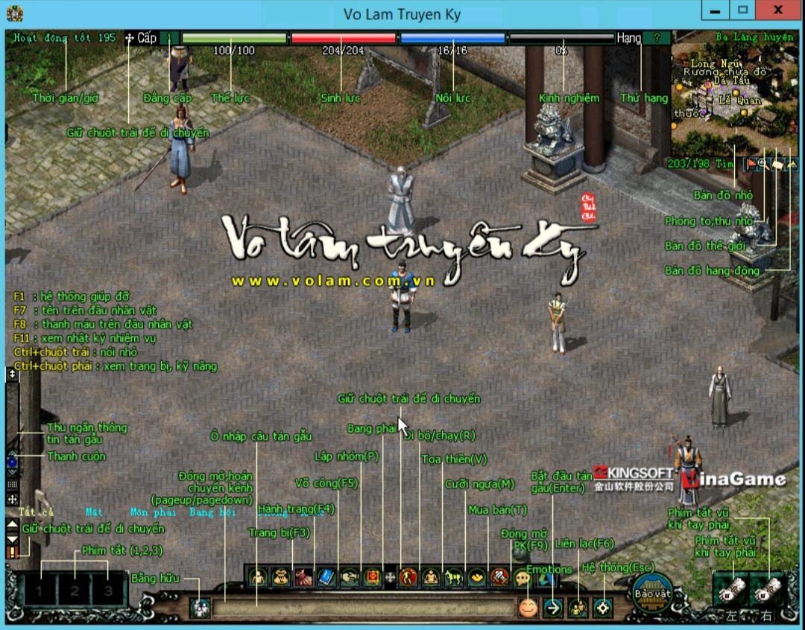

# Lịch Sử

- Võ Lâm Truyền Kỳ 2005 là một tựa game nhập vai trực tuyến nhiều người chơi (MMORPG) nổi tiếng tại Việt Nam, phát hành vào ngày 21 tháng 3 năm 2005 bởi công ty VinaGame (nay là VNG). Được phát triển dựa trên trò chơi JX Online của công ty Kingsoft (Trung Quốc), Võ Lâm Truyền Kỳ nhanh chóng trở thành hiện tượng văn hóa và ghi dấu ấn sâu đậm trong lòng cộng đồng game thủ Việt.

- Lấy bối cảnh võ hiệp trong thế giới kiếm hiệp Trung Hoa cổ điển, trò chơi xoay quanh cuộc chiến giữa các môn phái nổi tiếng trong giang hồ như Thiếu Lâm, Võ Đang, Cái Bang, và Nga Mi. Võ Lâm Truyền Kỳ mang đến một trải nghiệm đậm chất kiếm hiệp, nơi người chơi không chỉ rèn luyện võ công mà còn tham gia các hoạt động cộng đồng như bang hội, giao dịch, và các trận chiến PvP quy mô lớn như Tống - Kim.

- Năm 2005, khi mới ra mắt, Võ Lâm Truyền Kỳ đã nhanh chóng tạo nên một cộng đồng đông đảo với hàng trăm nghìn người chơi tham gia, biến đây trở thành một trong những trò chơi trực tuyến thành công nhất ở Việt Nam lúc bấy giờ. Với nền đồ họa 2D đơn giản nhưng đẹp mắt, hệ thống gameplay hấp dẫn, Võ Lâm Truyền Kỳ đã ghi dấu ấn mạnh mẽ trong lịch sử game Việt Nam và tạo tiền đề cho nhiều sản phẩm MMORPG sau này.

- Trải qua nhiều phiên bản và sự kiện, Võ Lâm Truyền Kỳ không chỉ là một trò chơi, mà còn trở thành một phần tuổi thơ của nhiều game thủ thế hệ 8x và 9x tại Việt Nam, với những kỷ niệm khó quên về các trận chiến khốc liệt và tình bằng hữu trong thế giới ảo.

## Giới Thiệu

Mẫu Source Võ Lâm Truyền Kỳ Chuẩn Cày Cuốc 2005.

- Chắc hẳn các bạn vẫn còn nhớ một hồi ức về Võ Lâm năm xưa ,đánh hươu ,đánh nhím , luyện công ở các Map , Săn Boss ở các động một thời.

- Chúng tôi cố gắng giữ lại nét đặc trưng 20 năm của Võ Lâm Truyền Kỳ năm 2005 từ các lời thoại NPC Thành Thị, Nông Thôn đúng như bản gốc của VNG năm xưa.

- Vâng! Giờ đây bạn có thể quay về với tuổi thơ của mình năm xưa với tựa game Võ Lâm Truyền Kỳ được chúng tôi mang trở lại, tuy vẫn còn thiếu sót, nhưng chắc cũng đủ để bạn nhớ về một hồi ức, hằng ngày lang thang trong các tiệm NET , gửi tiền lên đảo để bằng hữu mình luyện Skill.

- Với tâm huyết khôi phục Võ Lâm chuẩn VNG 2005 bộ Script được edit rất kỹ từng chi tiết ,khi các bản nhạc nền thành thị vang lên khi chuyển Map đúng như bản gốc mang cho chúng ta cảm giác bồi hồi ,bân khuân một thời,hay cởi trên lưng con ngựa Hãm Huyết Long Câu, gia nhập môn phái một thời mình yêu thích.

- Kinh nghiệm chậm chuẩn cày cuốc.

- Skill 90 chuẩn VNG.

- Skill 120 chuẩn VNG.

- Hệ thống tiền vạn chuẩn VNG

- Event có thể bật hoặc tắt.

- Vật phẩm Event có thể nhận trong các hoạt động,hoặc rơi ở các Map 7X 8X 9X.

## Các Hoạt Động Trong Game.

- Tống Kim.

- Phong Lăng Độ.

- Quả Huy Hoàng.

- Quả Hoàng Kim.

- Boss Tiểu Hoàng Kim.

- Boss Đại Hoàng Kim.

- Boss Sát Thủ.

## Nhiệm Vụ Chính Tuyến.

- Nhiệm Vụ Dã Tẩu

- Nhiệm Vụ Hoàng Kim.

- Nhiệm Vụ Boss Sát Thủ.

- Nhiệm Vụ Vượt Ải.

## Hình Ảnh

## Hướng Dẫn Cài Đặt.

## Liên Hệ 

Mọi Ý Kiến Đóng Góp Vui Lòng Liên Hệ Email Khi Cần Hỗ Trợ Đừng Ngần Ngại Chúng Tôi Hỗ Trợ Bạn:

## Lịch Sử Cập Nhật

## Cài Đặt
